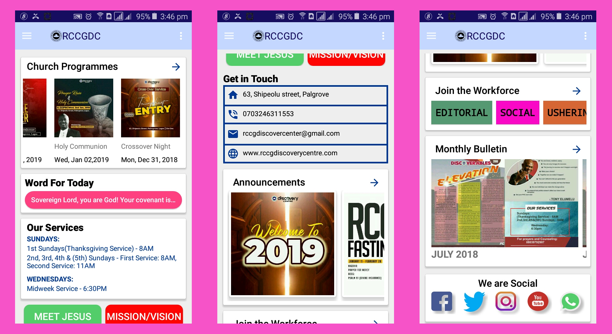
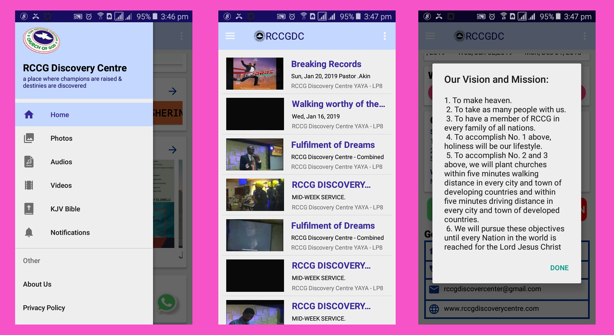

# RCCGDC-App

 

This is an android app for a church **(RCCG)** in Lagos, Nigeria. It displays upcoming and past church programmes, annoucements, bible verse for the day, monthly bulletin etc in different views. It also contains a picture library for past church events and videos of past messages and a bible among others.

The following were used in the App:
<ul>
  <li><a href='https://firebase.google.com/docs/auth/android/firebaseui'>Firebase Authentication</a></li>
  <li><a href='https://firebase.google.com/docs/database/android/start'>Firebase Database</a></li>
  <li><a href='https://firebase.google.com/docs/storage/android/start'>Firebase Cloud-Storage</a></li>
  <li><a href='https://firebase.google.com/docs/cloud-messaging/android/client'>Firebase Notifications</a></li>
  <li><a href='https://developers.google.com/youtube/v3/quickstart/android'>Youtube Data Api</a></li>
  <li><a href='http://www.ourmanna.com/verses/api/'> Our manna Api </a> for daily bible verse </li>
  <li><a href='https://github.com/chrisbanes/PhotoView'>Chris Banes PhotoView</a> for picture zooming, using multi-touch and double-tap. </li>
  <li><a href='https://github.com/bumptech/glide'>Glide </a></li>
  <li><a href='https://developer.android.com/training/volley/'>Volley</a></li>
  <li><a href='https://github.com/bumptech/glide'>Glide </a></li>
  <li><a href='https://developer.android.com/training/volley/'>Volley</a></li>
</ul>

